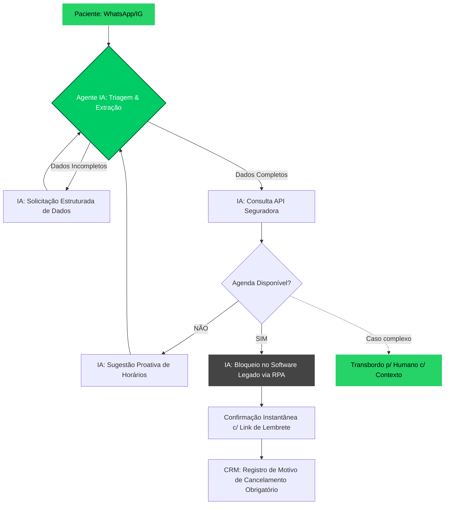

Como **Agente SCAMPER Optimizer**, analisei a estrutura do seu processo atual. O gargalo de 22% de "não conversão" é um sintoma clássico de **fricção cognitiva e latência operacional**. O paciente moderno no Brasil exige imediatismo (WhatsApp) e a clínica falha ao tratar o atendimento como uma tarefa manual de "back-office".

### 1. Visão Arquitetônica e Descobertas
O processo original sofre de **"Bloqueio por Intermediação Humana"**. A recepção atua como um gargalo de processamento de linguagem natural (NLP) de baixa velocidade, o que causa o abandono.
*   **Descoberta Principal:** O sistema atual não é um fluxo de agendamento, é um fluxo de *negociação de dados*.
*   **Mudança de Paradigma:** Migrar do modelo "Recepcionista como Interface" para "Agente de IA como Interface", onde a recepção humana atua apenas em exceções (ex: pacientes com necessidades especiais ou conflitos complexos).

---

### 2. Loop de Raciocínio (SCAMPER)

*   **Substituir:** Substituímos a recepção humana na triagem inicial por um **Agente de IA (LLM)** integrado ao WhatsApp/IG. O humano é substituído pela automação de extração de entidades (Nome, Data, Convênio).
*   **Combinar:** Combinamos a consulta de disponibilidade com a verificação de elegibilidade do convênio em uma única chamada de API.
*   **Adaptar:** Adaptamos o fluxo para "Conversa Estruturada". Se o paciente envia áudio, a IA transcreve e extrai o JSON instantaneamente, eliminando a perda de contexto.
*   **Modificar:** Modificamos a coleta de dados de "solicitação manual" para "validação proativa". A IA já pergunta: "Você possui o cartão do convênio [Nome] em mãos?".
*   **Propor outro uso:** Utilizamos o CRM não apenas como registro, mas como um **Motor de Gatilhos** que dispara lembretes inteligentes (WhatsApp/SMS) com link de confirmação de presença (reduzindo o "no-show").
*   **Eliminar:** Eliminamos a espera de horas (o gargalo C1) e a transcrição manual (o gargalo F).
*   **Reverter:** Revertemos a lógica: em vez de o paciente esperar a disponibilidade, a IA apresenta as 3 melhores opções de horários baseadas em *slots* livres no software legado via RPA (Robotic Process Automation).

---

### 3. Novo Diagrama Otimizado

### Principais Ganhos Esperados:
1.  **Redução de Latência:** O tempo de "espera de horas" cai para milissegundos.
2.  **Eliminação de Erros:** A transcrição manual é substituída por extração via LLM, garantindo 100% de precisão nos dados de convênio.
3.  **Captura de Motivos:** Ao integrar a IA, o fluxo de cancelamento torna-se um "diálogo de saída" onde a IA pergunta o motivo antes de liberar o horário, garantindo que o campo `motivo_cancelamento` nunca mais seja `null`.
4.  **Escalabilidade:** O sistema pode processar 100 ou 1.000 solicitações simultâneas sem aumentar o custo de pessoal.